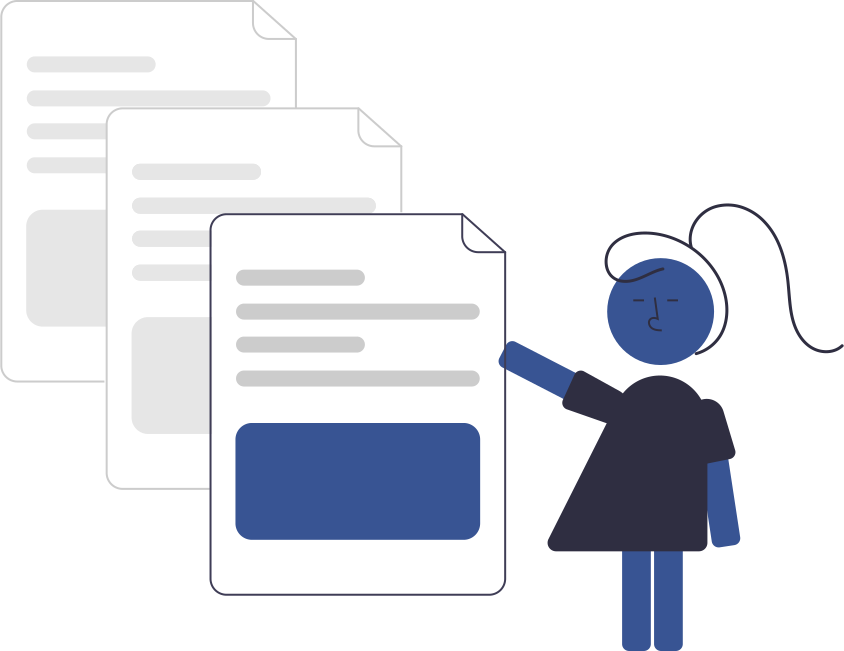

# Welcome to Campus Infrastructure Management API Docs! :paperclips:
<!-- https://witsgroup-1.github.io/campus-infrastructure-management-docs/ -->
---

<p style="text-align: center;">
    
</p>

---

> **Made By Group -1:**<br>
> Dineo Chiloane (2563191) :woman_technologist:<br>
> Claire Newman (2549861) :woman_technologist:<br>
> Chloe Dube(2602515) :woman_technologist:<br>
> Mayuri Balakistan (2543986) :woman_technologist: <br>
> Busisiwe Vemba (2561620) :woman_technologist:<br>
> Menzi Shazi (2453308) :man_technologist:<br>

# Introduction :book:

The Classroom/Venue Management App is designed to enhance the efficiency of managing classroom and venue assignments, bookings, and maintenance on campus. This application integrates seamlessly with academic schedules, providing a centralized platform for room bookings, maintenance issue reporting, and schedule management.

Key features include a room booking system that allows users to reserve classrooms and venues for various purposes, a visual availability calendar for easy schedule viewing, and a notification system to keep users informed of upcoming bookings and updates. The app also supports an admin interface for managing schedules and maintenance tasks, ensuring that all aspects of campus venue management are handled efficiently.

While push notifications are a stretch goal, the app’s secure and scalable infrastructure is built to ensure data integrity and availability. The user-friendly dashboard and robust APIs for booking, scheduling, maintenance, notifications, and user management together provide a comprehensive solution for optimizing space utilization on campus.

---


# API Specifications :memo:

## User Management API :bust_in_silhouette:

<iframe src="./swagger/user-api.html" width="100%" height="800px"></iframe>

## Booking API :calendar:

<iframe src="./swagger/booking-api.html" width="100%" height="800px"></iframe>


## Schedule API :watch:

<iframe src="./swagger/schedule-api.html" width="100%" height="800px"></iframe>


## Maintenance API :hammer_and_wrench:

<iframe src="./swagger/maintenance-api.html" width="100%" height="800px"></iframe>

## Notification API :bell: 

### Purpose  <!-- {docsify-ignore} -->

The Notification API handles the scheduling and delivery of notifications to users, including reminders for upcoming bookings and updates on maintenance requests.

### Endpoints  <!-- {docsify-ignore} -->

#### Create Notification  <!-- {docsify-ignore} -->

* **Endpoint:** `POST /api/notifications`
* **Description:** Create a new notification to be sent at a specific time.
* **Request Body:**
```json
{
  "userId": "Lecturer1923",
  "type": "booking_reminder",
  "message": "Reminder: Your booking for Room101 starts in 30 minutes.",
  "sendAt": "2024-08-19T09:30:00Z"
}
```
* **Response:**
```json
{
  "notificationId": "notif123",
  "message": "Notification scheduled successfully."
}
```

#### Get Notifications for User  <!-- {docsify-ignore} -->

* **Endpoint:** `GET /api/notifications/user/{userId}`
* **Description:** Retrieve all notifications scheduled for a specific user.
* **Response:**
```json
[
  {
    "notificationId": "notif123",
    "type": "booking_reminder",
    "message": "Reminder: Your booking for Room101 starts in 30 minutes.",
    "sendAt": "2024-08-19T09:30:00Z"
  },
  ...
]
```

#### Update Notification  <!-- {docsify-ignore} -->

* **Endpoint:** `PUT /api/notifications/{notificationId}`
* **Description:** Update an existing notification (e.g., change the message or send time).
* **Request Body:**
```json
{
  "message": "Reminder: Your booking for Room101 starts in 15 minutes.",
  "sendAt": "2024-08-19T09:45:00Z"
}
```
* **Response:**
```json
{
  "notificationId": "notif123",
  "message": "Notification updated successfully."
}
```

#### Delete Notification  <!-- {docsify-ignore} -->

* **Endpoint:** `DELETE /api/notifications/{notificationId}`
* **Description:** Delete a scheduled notification.
* **Response:**
```json
{
  "message": "Notification deleted successfully."
}
```

#### Send Immediate Notification  <!-- {docsify-ignore} -->

* **Endpoint:** `POST /api/notifications/send`
* **Description:** Send a notification immediately without scheduling.
* **Request Body:**
```json
{
  "userId": "Lecturer1923",
  "type": "booking_reminder",
  "message": "Immediate notification: Your booking for Room101 is starting now."
}
```
* **Response:**
```json
{
  "notificationId": "notif124",
  "message": "Notification sent successfully."
}
```


